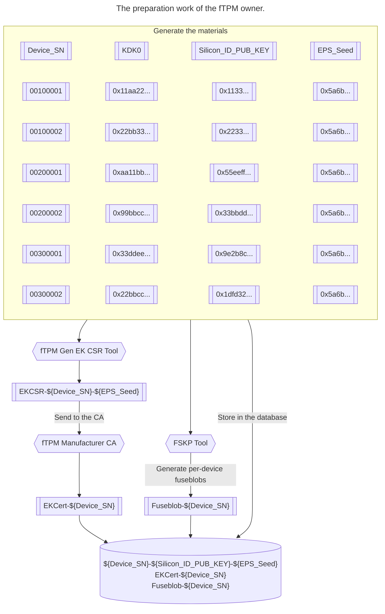
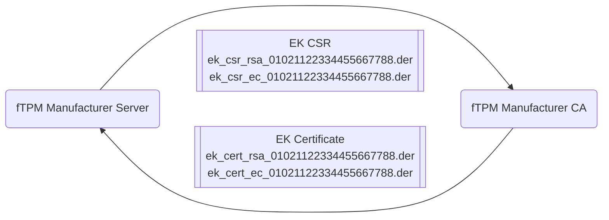
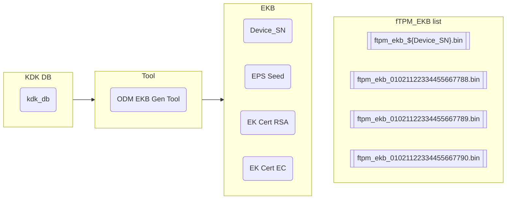
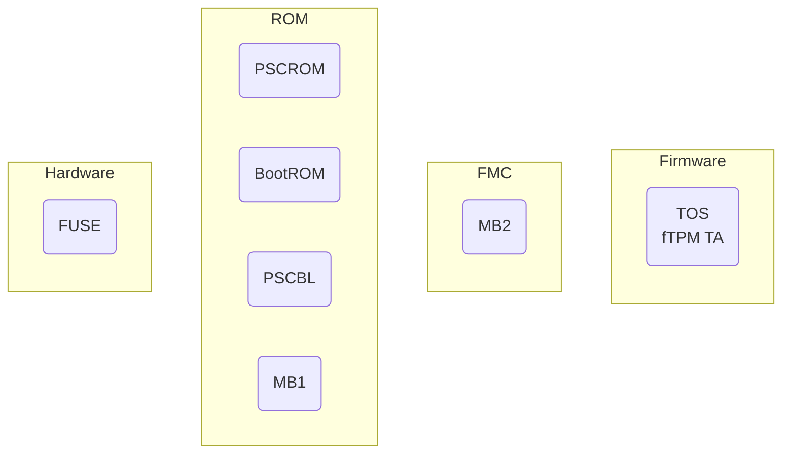

# Overview of the Firmware TPM implementation on Jetson

__Applies to__ the Jetson AGX Orin, the Jetson Orin NX series, and the Jetson Orin Nano series.

Before you begin, please reference the TCG website for the TPM specification and knowledge.
- [TCG TPM2 Brief Overview](https://trustedcomputinggroup.org/wp-content/uploads/2019_TCG_TPM2_BriefOverview_DR02web.pdf)
- [TPM 2.0 Specification](https://trustedcomputinggroup.org/resource/tpm-library-specification/)
- [TCG Documentation Portal](https://trustedcomputinggroup.org/resources/?)

The Firmware TPM (__fTPM__) implementation is done by leveraging the official [TCG reference implementation of the TPM 2.0 specification](https://github.com/Microsoft/ms-tpm-20-ref). The reference implementation includes a sample fTPM Trusted Application (TA) designed to be executed with OP-TEE.

A fundamental difference exists between a discrete TPM (DTPM) and fTPM. A DTPM or a TPM chip has been provisioned by the TPM vendor or manufacturer with the Endorsement Key (EK) certificate, which is the TPM identification that can be used for TPM attestation. Without this certificate, the TPM is not useful, because trust can not be constructed between the TPM user and the services that rely on TPM.

To create a trustworthy fTPM entity on different devices, you need to provision it with a per-device unique ID, the EK certificate, and this needs to be done during the device manufacturing process.

The fTPM implementation on Jetson includes two sample applications:
- fTPM TA from [ms-tpm-20-ref](https://github.com/Microsoft/ms-tpm-20-ref).
- fTPM helper applications
    - The helper applications provide the functionalities for the provisioning process.

# The fTPM Provisioning

The fTPM provisioning is a process we designed to make the Jeton device deal with the fTPM manufacturer Certificate Authority (CA) server. There are two kinds of provisioning methods: offline provisioning and online provisioning.

- Offline provisioning method
    - The offline provisioning method needs the fTPM manufacturer to pre-generate the EK certificates and encode it into the Encrypted Keyblob (**EKB**). This process needs to be completed during the device manufacturing process. When the device boots up, You can use a provisioning tool to query the EK certificates from EKB and store them in the fTPM non-volatile (NV) memory.
- Online provisioning method (Not available yet in the implementation)
    - The online provisioning method depends on a three-way handshake protocol between the CA and the device to validate the device identity, sign, and issue the EK certificate.

## Preparation before the fTPM provisioning process (Offline method)

### The Prerequisites of the fTPM Owner
- Here is a list of the tasks that the fTPM owner can complete:
    - This role is identical to the DTPM vendor or manufacturer and is the Original Design Manufacturer (ODM) of the fTPM provisioning support.
    - It should be a third-party service provider with expertise in fTPM production.
    - It should be able to set up a secure environment to work with the fTPM provisioning process.
    - The CA server held by the fTPM owner should be acknowledged by the popular cloud service provider with which devices are designed to be enrolled.
    - It should meet the requirements for preparing and generating materials for fusing the devices and keeping them secure.
    - It should support multiple Original Equipment Manufacturers (OEMs) which means that the fTPM owner should work with multiple OEMs and maintain and isolate the materials for different OEMs.
- The requirements of the material preparation and the generation work.
    - The per-device basis KDK0, Device_SN, Silicon_ID, and Silicon_ID public key generation.
        - This can be done by running the kdk_gen.py KDK Gen tool, where:
            - KDK0 is a secret per-device unique 256-bit random value.
            - SN is a per-device unique serial number.
            - OEM_ID is an OEM_ID number for different OEMs.
            - Device_SN is the concatenation of OEM_ID and SN where OEM_ID and SN are in the big-endian form.
        - The public key of Silicon_ID
            - This public key can be used for the fTPM provisioning tool to verify the materials signed by the Silicon_ID private key.
            - The public key is generated by Silicon_ID_Seed where:
                - Silicon_ID is KDF(key=KDK0, Device_SN).
                - The asymmetric key pair of SiliconID is ECC_P256_key_gen(seed=Silicon_ID).
                - The private key should be dropped immediately.
        - ==Note==: The KDK0 should be discarded after the corresponding fuseblob, the EK, and the EK-associated certificate are generated.
    - The per-device basis fuseblob generation.
        - This task can be completed by running the FSKP tool (fskp_fuseburn.py).
        - Here is a list of the properties that are related to the fTPM:
            - Fuse_ODM_INFO is ${OEM_ID}.
            - Fuse_ODMID0/1 is ${SN}.
            - Fuse_KDK0 is ${KDK0}.
        - The KDK0 should be discarded after a corresponding fuseblob and EK are generated. The purpose of not keeping it in storage is to avoid potential leaks.
    - The per-device basis fTPM EKB generation.
        - This task can be completed by running the odm_ekb_gen.py ODM EKB Gen tool.
        - Here are the fTPM EKB properties:
            - EPS Seed is 256-bit random number that will be used for the EPS deriving process.
            - The EK Certificate Signing Request (CSR).
                - The EK CSR will be generated and sent to the CA for signing.
            - EK Certificate
                - The EK Certificate will be issued by the CA after signing the CSR.
        - EKB is per-device EKB image with the following fTPM properties:
            - Device_SN, EPS Seed
            - EK certificates (RSA and EC)
    - The database generated by the fTPM manufacturer:
        - ${Device_SN}
        - $(Silicon_ID_PUB_KEY)
        - ${EPS_Seed}
        - ${EK_Cert}

### Signing the EK CSRs
After the per-device EK CSR has been generated, the EK CSR needs to be signed by the fTPM manufacturer CA, and the CA returns the EK certificate. The EK should support two algorithms RSA and EC. During the preparation period, the fTPM owner should prepare two EK CSRs for the two algorithms and store the two certificates in the storage.

### Generating per-device EKB
The offline provision method aims to create a per-device EKB image with the device's fTPM properties:

- Device_SN, EPS Seed
- Two certificates (RSA and EC).

The ODM EKB Gen Tool encodes the fTPM properties into the EKB image and the output of the per-device EKB images is saved as an unencrypted binary file with the Device_SN as the filename index.

> [!Note] Here is some important information about the EKB contents:
> - EKB also contains device manufacturer (OEM) defined keys such as the UEFI payloads encryption key, the UEFI variable authentication key, and the disk encryption key (called user keys in general). After the per-device-based fTPM property EKB, which is called fTPM_EKB, is generated in plain binary form by the fTPM manufacturer (by running odm_ekb_gen.py), the ftpm_EKB is sent to the device manufacturer so that the user keys can be added by running oem_ekb_gen.py by the device manufacturer.
> - The final result EKB that contains the fTPM_EKB, and user keys is encrypted and signed by K1-derived keys. K1 is owned by device manufacturer and is burned to OEM_K1 fuse through OEM_fuseblob.
> - The [The fTPM Production Flow](#the-ftpm-production-flow) section provides more information about fuseblob generation and burning by using the FSKP tool.

## The Key Derivation Process to support fTPM

This section provides a list of the prerequisites to use Jetson Secure Bootloaders. The fTPM provisioning process relies on the secure boot support on the Jetson platform. The secure boot function should construct Hardware Root of Trust (HROT) and Root of Trust for Measurement (RTM) because they are needed for the device attestation in the fTPM provisioning process.

The Trusted Computing Base (TCB) of the Jetson platform consists of the security-relevant components that have been loaded at the stage of the secure boot chain.

- The role in the secure boot chain
    - The hardware and ROM are the HROT of secure boot and also the ROT and RTM of the secure boot on the device.
    - FUSE
        - KDK0: A secure fuse slot on Jetson Orin. It will be used to derive the Silicon ID Seed.
    - ROM
        - This includes the ROM and ROM extension code.
            - PSCROM and BootROM are the static and fixed codes stored in the ROM.
            - PSCBL and MB1 is the ROM extension code to execute the bottom half of the initial boot.
    - First Mutable Code (FMC)
        - MB2 is the boot loader that handles the construction of the components for fTPM provisioning support.
    - Firmware
        - Trusted OS (TOS) is the trusted firmware that includes ARM Trusted Firmware (ATF), OP-TEE OS with the fTPM, and fTPM helper TAs.

### Silicon ID Provisioning Flow in Secure Boot

The Silicon ID Seed provisioning flow along the TCBs in the secure boot chain. There are three layers:
- Hardware and ROM (PSCROM, BootROM, PSCBL, and MB1).
- FMC (MB2).
- Firmware (TOS).

The purpose of this flow is to generate a Silicon ID seed, fTPM seed, the signature of MB2 event log, and the signature of TOS event log. The security mechanism of the key generation flow uses the TZ-SE, which is the hardware Security Engine in the TrustZone, but the keyslot is not accessible by the CPU. The Silicon ID key pair and the signatures of the event logs are generated by MB2 and are passed to OP-TEE using encrypted TZ memory and are used to identify the device and the firmware status during the fTPM provisioning process (if needed).

The Silicon ID generation flow:
- In the PSCBL layer:
    - Silicon_ID is the KDF(key=KDK0, Device_SN)
        - The Device_SN is a unique number that comprises an OEM_ID and a unique serial number in the OEM_ID.
- In the MB2 layer:
    - fTPM Seed
        - The fTPM Seed is KDF(key=Silicon_ID, constant str1).
    - Silicon ID Key Seed.
        - The Silicon ID Key Seed is KDF(key=Silicon_ID, constant str2).
    - The Silicon_ID key pair.
        - The Silicon_IDkey pair is f(ECC, NIST P256)KEYGEN(seed=Silicon_ID_Key_Seed).
    - The signature of the MB2 event log.
        - The Event_log_MB2.sig is f(ECDSA)SIGN(key=Silicon_IDpriv key, digest=SHA512(MB2)).
    - The signature of the TOS event log.
        - The Event_log_TOS.sig is f(ECDSA)SIGN(key=Silicon_IDpriv key, digest=SHA512(TOS)).

### EPS Derivation Flow in the OP-TEE OS Layer

The Endorsement Primary Seed (EPS) is the ROT of the fTPM entity and is tied with the EK, which can be used to attest the TPM identity and the keys generated by the TPM. The EPS is derived with the layer of TCB in the Jetson device to the TOS layer. The fTPM helper PTA in the OP-TEE OS implements the EPS derivation process by using the fTPM Seed from the bootloader and the fTPM property in the EKB.

The EPS will be injected into fTPM TA during the TA's first start-up time and stored in NV memory.

- In the fTPM helper PTA layer:
    - Here is the EPS derivation flow:
        1. Device_SN is fuse_read(ODMID, ODM_INFO).
        2. fTPM Root Seed
            - The fTPM Root Seed is KDF(key=fTPM_Seed, constant str).
        3. EPS
            - The EPS is KDF(key=fTPM_Root_Seed, info=Device_SN, salt=EPS_Seed).

> [!Note]
> - The EPS Seed is a random number that is generated by odm_ekb_gen.py and stored in EKB.

## The fTPM Production Flow

The fTPM production flow is the design of provisioning an EK certificate by the fTPM manufacturer who owns the CA and fTPM manufacturing server and is qualified to issue the certificate. This should be done in a secure environment during the fTPM manufacturing process.

Here are the requirements of the fTPM Manufacturer Server:
- This server should be a secure environment and have Hardware Secure Module (HSM) support.
- This server is responsible for generating the materials for fTPM production.

Here are the requirements of the fTPM Manufacturer CA:
- A CA ==MUST== verify fTPM residency of a key before signing a certificate. This can be done by verifying the signature of the EK CSR.
- The CA ==SHOULD== support a standard certificate transport protocol that provides protection from replay attacks and provides confidentiality and integrity.

~~~mermaid
sequenceDiagram
	participant odm as fTPM Design Manufacturer (ODM) fTPM Manufacturer Server
	participant oem as OEM Manufacturer OEM Manufacturer Server
	participant oem_factory as OEM Manufacturer Factory

	critical
		Note over odm: ODM Fuseblob Generation
		Note over odm: 1. Generating keys and Materials owned by ODM (ODM_KDK0, PKC, SBK, ODM_ID, and SN, etc.)
		Note over odm: 2. Generating ODM fuseblob The fuseblob is encrypted and signed by ODM owned fskp key (or fskp expansion key).
		Note over odm: 3. Storing fuseblobs in the database (ODM_fuseblob_db)
	end

	critical
		Note over oem: OEM Fustblob Generation
		Note over oem: 1. Generating OEM K1 and K2 keys
		Note over oem: 2. Generating OEM fuseblob
	end

	critical
		Note over odm: ODM EKB Generation Phase 1
		Note over odm: 1. Generating EPS Seed and EK Certificates
		Note over odm: 2. Generating EKB_ftpm_db
	end

	odm->>oem: Send EKB_ftpm_db to OEM

	critical
		Note over oem: OEM EKB Generation
		Note over oem: 1. Generating the user-defined keys in EKB
		Note over oem: 2. Merging the EKB_ftpm_db from ODM and  the user-defined keys.
		Note over oem: 3. Encrypting the EKB image by OEM K1.
		Note over oem: 4. Output the EKB_final_db
	end

	oem->>odm: Send EKB_final_db to ODM

	critical
		Note over odm: ODM EKB Generation Phase 2
		Note over odm: 1. Storing the EKB_final_db
	end

	critical
		Note over odm: ODM packages Generation
		Note over odm: 1. Generating the QSPI Image
		Note over odm: 2. Signing and encrypting the EKB_final_db by using PKC and SBK keys and output EKB_db.signed
		Note over odm: 3. Generating per OEM basis package ODM_fuseblob_db, QSPI image, and EKB_db.signed
	end

	odm->>oem: Send the above packages to OEM

	critical
		Note over oem: OEM packages Generation
		Note over oem: 1. Generating complete QSPI image package
		Note over oem: 2. Generating mass storage (eMMC or NVMe ) image package
	end

	oem->>oem_factory: Deliver the packages to the factory

	Note over oem_factory: Running FSKP tool Burn the per device basis fuse: ODM_fuseblob_db

	Note over oem_factory: Running FSKP tool Burn the OEM owned fuse: OEM_fuseblob

	Note over oem_factory: Running flashing tool 1. flashing images to QSPI and mass storage. 2. flashing the per device specific EKB from EKB_db.signed.
~~~

The diagram shows the fTPM production flow.

Here are the roles in the diagram:
- The fTPM Design Manufacturer:
    - Is the owner of the fTPM manufacturer server and the fTPM manufacturer CA.
    - Delivers the fTPM packages to OEM.
- The OEM Manufacturer:
    - Owns the OEM defined fuse keys.
    - Owns the user-defined keys in EKB.
    - Owns the OS bootloader e.g. UEFI and UEFI payloads such as L4TLauncher.
    - Generates the packages for production.
- The OEM Manufacturer Factory assembles, fuses, and flashes the devices.

Here is the fTPM production flow:
- ODM Fuseblob Generation
    - The keys and materials, such as ODM_KDK0, SN, PKC, and SBK keys, which are owned by ODM are generated.
    - The ODM fuseblob is generated.
        - Run the "KDK Gen Tool" (kdk_gen.py) to generate **ODM_KDK_db**. (db means database.)
        - Run the fuse burn tool (fskp_fuseburn.py) with ODM_KDK_db and PKC, SBK keys as input.
            - The ODM fskp key will be used as the signing and encryption key to generate the ODM signed **ODM_fuseblob_db**.
    - The fuseblobs are stored in the database.
        - The fuseblob database (ODM_fuseblob_db) is a list of individual files, such as odm_fuseblob-${Device_SN}.bin.

- OEM Fuseblob Generation
    - The fuse keys owned by OEM such as OEM_K1 and OEM_K2.
        - The OEM fuseblob is generated.
            - Run the fuse burn tool (fskp_fuseburn.py) with the OEM fuse configuration XML file.
                - The field such as OEM_K1, OEM_K2, SECURITY_INFO, SECURITY_MODE, etc, should be filled in the configuration file.
                - The OEM fskp key will be used as the signing and encryption key to generate the OEM signed **OEM_fuseblob**.

- The ODM EKB Generation Phase 1.
    - The EPS Seed and EK Certificates are generated.
        - This will use the fTPM Gen CSR tool to generate the fTPM EK CSR.
        - The EK CSR should be delivered to the CA and signed by the CA.
        - The CA returns the EK certificate.
    - The **EKB_ftpm_db** is generated.
        - Run the ODM EKB Gen tool (odm_ekb_gen.py) with the ODM_KDK_db as the input.
    - Send the **EKB_ftpm_db** to OEM.

- OEM EKB Generation
    - The user-defined keys that will be encoded into EKB are generated.
    - Run the OEM EKB Gen tool (oem_ekb_gen.py) to merge the EKB_ftpm_db and user-defined keys.
        - Use the OEM_K1 key as the encryption key to generate OEM encrypted **EKB_final_db**.
    - Send the **EKB_final_db** to ODM.

- ODM EKB Generation Phase 2
    - Receiving and storing the EKB_final_db.

- ODM Packages Generation
    - Generating the QSPI image, for example, you can run the flashing tool with PKC and SBK keys to generate, sign, and encrypt images for all partitions on QSPI.
        - ==Note:== The generated UEFI and EKB are used only as placeholders. The final UEFI is generated and signed by OEM, and the final EKB is loaded from EKB_final_db.
    - Sign and encrypt the EKB_final_db by using PKC and SBK keys and output EKB_db.signed.
    - Generate the per-OEM packages.
        - ODM_fuseblob_db, QSPI image, and EKB_db.signed

          > [!Note] Here is some important information:
          > - ODM_fuseblob_db contains a list of encrypted and signed fuseblobs including odm_fuseblob-<Device_SN>, odm_fuseblob-<Device_SN+1>, and so on.
          > - EKB_db.signed contains a list of PKC and SBK signed and encrypted EKB such as ekb-<Device_SN>.signed, ekb-<Device_SN+1>.signed, and so on.
          > - It is a one-to-one mapping between odm_fuseblob-<Device_SN> and ekb-<Device_SN>, and the flashing tool ensures ekb-<Device_SN> is only flashed to the device with fuseblob-<Device_SN> burned.
    - Send the packages to OEM.

- OEM Packages Generation
    - Generate the complete QSPI image package.
    - Generate the mass storage (eMMC or NVMe) image package.
    - Deliver the package to the factory.

- OEM Factory
    - Burn the per-device bases ODM fuseblob.
    - Burn the OEM fuseblob.
    - Flash the device.
        - Flash the QSPI and the mass storage.
        - Flash the per-device basis EKB image.

## The Software Architecture to Support fTPM Provisioning
~~~mermaid
graph LR
	subgraph optee [OP-TEE]
		direction TB
		subgraph sel0 [S-EL0]
			direction LR
			ftpm_helper_ta(fTPM Helper TA)
			ftpm_ta(fTPM TA)
			ftpm_helper_ta ~~~ ftpm_ta
		end
		subgraph sel1 [S-EL1]
			ftpm_helper_pta(fTPM Helper PTA)
		end
	end
	subgraph el0 [EL0]
		direction LR
		ftpm_prov_script(fTPM provisioning script)
		ftpm_helper_ca(fTPM Helper CA)
		ftpm_prov_script ~~~ ftpm_helper_ca
	end

	el0 ~~~ sel0
~~~
The SW Components
- fTPM provisioning script
    - This sample script handles the fTPM provisioning process on the Jetson device.
    - The provisioning process on the device.
        - Querying the EK certificates from the EKB.
        - Storing the EK certificate to the fTPM NV memory.
        - Taking ownership of the fTPM.
        - Creating EK accordingly with the default EK handles.
    - The provisioning process only needs to be activated once.
    - This script should be bundled with the fTPM support package provided by the fTPM design manufacturer (ODM).
- The fTPM helper TA/CA and PTA
    - They are the applications designed for fTPM provisioning support.
    - fTPM helper CA
        - The fTPM helper CA provides the command line interface (CLI) for the script to query the EK certificates from the EKB.
    - fTPM helper TA
        - The fTPM helper TA provides the interfaces to support the fTPM helper CA.
        - It helps to query SN, event log signatures, and EK certificates.
    - fTPM helper PTA
        - The fTPM helper PTA helps to gather the fTPM properties from MB2 and EKB.
        - The fTPM helper PTA retrieves Device SN from the fuse and makes sure it matches with the Device SN in EKB.
        - The EPS derivation function will be executed by the PTA.
- fTPM TA
    - The fTPM TA should support the TPM2 functionalities defined by TCG.
    - The TPM2 function in the fTPM TA should be a black box. It should NOT provide any interface other than TCG defined to access the TPM internal functions.
    - The fTPM TA gets the EPS from the fTPM helper PTA during the first startup time and stores the EPS in the NV memory.

## The fTPM Provisioning and Activation Flow

~~~mermaid
sequenceDiagram
	participant pscbl as PSCBL
	participant mb2 as MB2
	participant fhpta as fTPM-helper PTA
	participant fta as fTPM TA
	participant fhta as fTPM-helper TA
	participant fhca as fTPM-helper CA
	participant usrspace as User Space

	box Secure Bootloaders
		participant pscbl
		participant mb2
	end

	box Secure World
		participant fhpta
		participant fhta
		participant fta
	end

	box Normal World
		participant fhca
		participant usrspace
	end

	Note left of pscbl: Device Power On

	critical
		Note over pscbl: Silicon_ID Derivation
		Note over pscbl: 1. Silicon_ID = KDF(KDK0, Device_SN)
	end

	critical
		Note over mb2: fTPM_Seed Derivation
		Note over mb2: 1. fTPM_Seed = KDF(Silicon_ID, const str1)
		Note over mb2: 2. Generating the Silicon_ID key pair
		Note over mb2: 3. Signing the MB2 event log
		Note over mb2: 4. Signing the TOS event log
	end

	critical
		Note over mb2: fTPM MeasuredBoot Support
		Note over mb2: 1. Packaging the MB2 and TOS event log into tpm_event_log buffer.
	end

	mb2->>fhpta: Delivering the OP-TEE DTB
	Note over mb2,fhpta: The OP-TEE DTB includes: 1. fTPM_Seed 2. Silicon_ID public key 3. Signature of the MB2 event log 4. Signature of the TOS event log 5. The tpm_event_log buffer

	Note left of fhpta: OP-TEE OS Boots Up

	critical
		Note over fhpta: Launching the fTPM TA
		fhpta->>fta: Launching the fTPM TA
	end

	critical
		Note over fta: fTPM Measured Boot Support
		Note over fta: 1. Parsing the tpm_event_log buffer 2. Updating the MB2 and TOS event log into PCR0 via tpm2_pcrextend command
	end

	critical
		Note over fhpta: Gathering the fTPM Data from OP-TEE DTB and EKB
		Note over fhpta: The fTPM content in DTB: 1. fTPM_Seed 2. Silicon_ID public key 3. Signature of the MB2 event log 4. Signature of the TOS event log
		Note over fhpta: The fTPM content in EKB: 1. Device_SN 2. EPS Seed 3. EK Certificates
	end

	Note over usrspace: Kernel Boots Up To User Space
	Note over usrspace: Starting up the fTPM TA Inserting the fTPM Driver Module (Running "modprobe tpm_ftpm_tee")

	usrspace->>fta: Initializing the fTPM TA

	critical
		Note over fta: Initializing fTPM TA
		Note over fta: Provisioning EPS (Only needs to be done at 1st startup time for initial provisioning) 1. Invoking the EPS derivation function
		fta->>fhpta: Invoking the EPS derivation function
		Note over fhpta: Processing the EPS derivation function 1. Device_SN = fuse_read(ODMID, ODMINFO) 2. fTPM Root Seed = KDF(key=fTPM_Seed, const str) 3. EPS = KDF(key=fTPM_Root_Seed, info=Device_SN, salt=EPS_Seed)
		fhpta->>fta: Returning EPS
		Note over fta: 2. Storing EPS in fTPM NV memory
	end

	critical
		Note over usrspace: fTPM EK Provisioning and Activation (Running ftpm_device_provisioning.sh)
		Note over usrspace: 1. Querying EK Certificates

		usrspace ->>fhca: Querying EK Certificates
		fhca->>fhta: Querying EK Certificates
		fhta->>fhpta: Querying EK Certificates
		fhpta->>fhta: Returning EK Certificates
		fhta->>fhca: Returning EK Certificates
		fhca->>usrspace: Returning EK Certificates

		Note over usrspace: 2. Taking the ownership of the fTPM (Setting up the authentication value for the fTPM owner)

		usrspace->>fta: Sending tpm2_changeauth command

		Note over usrspace: 3. Creating EK

		usrspace->>fta: Sending tpm2_createek command

		Note over usrspace: 4. Writing the EK certificates into fTPM NV memory

		usrspace->>fta: Sending tpm2_nvwrite command

		Note over usrspace: fTPM has been provisioned and activated.
	end
~~~

# Cheat Sheet

## Set up the server to run the fTPM production scripts

- Install the required Python modules
~~~
sudo apt-get update
sudo apt-get install python3-pip
sudo apt-get remove python3-cryptography
sudo pip3 install asn1crypto
sudo pip3 install cryptography
sudo pip3 install ecdsa
sudo pip3 install numpy
sudo pip3 install oscrypto
sudo pip3 install pyaes
sudo pip3 install pycryptodomex
~~~
- Fix the issue of asn1crypto manually ([Ref link](https://github.com/wbond/asn1crypto/issues/260))
	- Apply the fix below into "/usr/local/lib/python3.8/dist-packages/asn1crypto/x509.py".
~~~
diff --git a/asn1crypto/x509.py b/asn1crypto/x509.py
index 8cfb2c78be27..761594e1a77d 100644
--- a/asn1crypto/x509.py
+++ b/asn1crypto/x509.py
@@ -686,12 +686,12 @@ class NameTypeAndValue(Sequence):
         'domain_component': DNSName,
         'name_distinguisher': DirectoryString,
         'organization_identifier': DirectoryString,
-        'tpm_manufacturer': UTF8String,
-        'tpm_model': UTF8String,
-        'tpm_version': UTF8String,
-        'platform_manufacturer': UTF8String,
-        'platform_model': UTF8String,
-        'platform_version': UTF8String,
+        'tpm_manufacturer': DirectoryString,
+        'tpm_model': DirectoryString,
+        'tpm_version': DirectoryString,
+        'platform_manufacturer': DirectoryString,
+        'platform_model': DirectoryString,
+        'platform_version': DirectoryString,
         'user_id': DirectoryString,
     }
~~~

## Supporting Production with fTPM
This section provides information about supporting production with fTPM.

Here are the prerequisites to Enabling fTPM with HW Silicon ID support:

- The KDK0 is the root key and must be burned with a 256-bit per-device unique secret value.
- The FUSE_BOOT_SECURITY_INFO must be burned with the following bits:

| Bits  | Description                                                                                         |
| ----- | --------------------------------------------------------------------------------------------------- |
| [2:0] | The authentication scheme field cannot be zero or over 101b. It must be a valid PKC auth scheme. |
| [9]   | OEM key valid. This bit must be 1.                                                                  |
| [11]  | OEM key function. This bit must be 1 to enable the KDF of the OEM fuse key.                         |
| [13]  | OEM key function. This bit must be 1 to enable the KDF of the Silicon ID generation.                |

## KDK Database and Fuseblobs Generation

This section provides information about generating the KDK database (DB) and fuseblobs.

### Installing FSKP package

> [!Note]
> - Before you install the FSKP package:
>     - Assume the Jetson Linux BSP has been installed on the host machine
>     - Copy "fskp\_partner\_t234\_${rel_version}\_aarch64.tbz2" to ${BSP_TOP}
> ~~~
> # Install the FSKP package
> cd Linux_for_Tegra
> tar jvxf ${BSP_TOP}/fskp_partner_t234_${rel_version}_aarch64_tbz2
> cd l4t/tools/flashtools/fuseburn
> ~~~
> - Before running FSKP tool, install the following Python modules:
> ~~~
> sudo pip3 install ecdsa
> sudo pip3 install pyaes
> ~~~

### Generating kdk-db and the corresponding Silicon ID Public Keys

> [!Tip] To generate kdk-db and the corresponding Silicon ID Public Keys, run kdk_gen.py.
> ~~~
> # Command line interface of "kdk_gen.py".
> kdk_gen.py [-h] [--oem_id ${OEM_ID}] [--sn ${SN}] [--num_devices ${NUM_OF_DEVICES}]
> ~~~
>
> For example, to generate five kdk entries, run the following command.
> ~~~
> kdk_gen.py --oem_id 0x102 --sn 0x100000002 --num_devices 5
> ~~~

The above example will generate the following files:
- kdk_db-01020000000100000002-5.csv
- pubkey_db-01020000000100000002-5.csv

> [!Important] Here is some important information:
> - The KDK database will be used to generate fuseblobs.
> - Here is the content of the KDK database:
> ~~~
> cat kdk_db-21-1000218000-5.csv
> 0102 0000000100000002 681a8d62bffb803e9b1068eb4e14af3e440b5a73d0e81d161d2817c24dac41a6
> 0102 0000000100000003 bfec6db0ddab599b2a34d01ab9e641e3b735d7ead9649579689ed535c73d2053
> 0102 0000000100000004 801575a8ecd51955f8efcc840af0b6f94a4a0d1e2745f97122d46873c83bd751
> 0102 0000000100000005 a8d49348cbbf34814b387c7189187a1c98fe03a254503e879232765651dcf0ee
> 0102 0000000100000006 a8e20c2e0309a6564d0c694c75fcce9b21b846c54dc3b6343a8c276bbbd2dca5
> # where the first two columns are oem-id and SN, and the last column is the randomly generated KDK value.
> ~~~

> [!Important] Here are the corresponding Silicon ID public keys:
> - The Silicon ID public key database can be used by the fTPM manufacturer CA to verify the device identity during the fTPM provisioning process.
> - The content of the Silicon ID public key database:
> ~~~
> cat pubkey_db-21-1000218000-5.csv
> 0102 0000000100000002 435ec556a1e23e9a676b8471ff2b2c25ca262bbc7f581abd69de025198cb56d157882fc257c4f544b206796dadf8257d5c4638e70bf8a2f13d9a2b7a30b57c0a
> 0102 0000000100000003 c25aef9b683cc4a2579bf634e35d42ee40b5e31dccef5dad7a16ab8b860dc2ec25a20ed6391edd8aa871cfa999acf57af1f81f1226e74569b2f3fff549bc0809
> 0102 0000000100000004 b603792a8d28ed60d5b7a6ac604fb56dfbff475cd225665253c58670c19d9b27ea1e0ec21de9ade7d798d0ada7a180c9625b72c6ec5b6074a265e4e8a90b0f6a
> 0102 0000000100000005 7c43b790f97769f86839be2ceaedbbba244d727c311d28c21a8f8ff9a911173d53753cb207ee5f7e11298fed41d603731fe709255f17b2fdf0c7113f15d97e11
> 0102 0000000100000006 ddc67040dbf78afd4a05581dacef51cd2c8cf0554c532b5ffda54f398f98f1136170fcd39ade40ba04db3ece703e0414eb6060cb10de0d7373e2b3a6c1b251ac
> # where the first two columns are oem-id and SN, and the last column is the corresponding silicon-id public key.
> ~~~

### Generating the Corresponding fuseblobs

- Create a template fuse configuration XML file called fuse_temp.xml like the following file:
    - The “OdmInfo” and “OdmId” are predefined fuse names used by fuse handling tools. Their content and usage are completely defined by the user. Here, based on the fuse length, the OEM_ID, and the SN are intended to be stored in these two fuses respectively.
~~~
<genericfuse MagicId="0x45535546" version="1.0.0">
    <fuse name="OdmInfo" size="4" value="0xFFFF"/>
    <fuse name="OdmId" size="8" value="0xFFFFFFFFFFFFFFFF"/>
    <fuse name="Kdk0" size="32" value="0xFFFFFFFFFFFFFFFFFFFFFFFFFFFFFFFFFFFFFFFFFFFFFFFFFFFFFFFFFFFFFFFF"/>
</genericfuse>
~~~

> [!Tip] To generate fuseblobs, run fskp_fuseburn.py.
> - For example, you can use the kdk db generated above to create five fuseblobs for AGX Orin.
> ~~~
> sudo ./fskp_fuseburn.py -f fuse_temp.xml \
>                         --test \
>                         --skipfskpkey \
>                         --multi-blob ftpm_kdk/kdk_db-21-1000218000-5.csv \
>                         -g out/ \
>                         -c 0x23 \
>                         --board-spec orin-agx-board-spec.txt \
>                         -B ../../../../jetson-agx-orin-devkit.conf
> ~~~
> Here are the command-line interface options:
> - -f <fuse_temp.xml>
>     - With the fuse template file, a list of corresponding fuse configurations will be generated and stored in the ftpm_kdk directory. In this example, a file list like the following is generated:
>         - fusexml-21-1000218000.xml
>         - ...
>         - fusexml-21-1000218004.xml
> - --test
>     - This indicates the generated fuseblob will only do a dry run. To actually burn the fuses, replace --test with -b.
> - --skipfskpkey
>     - This indicates that no fskp key is used, which means the fuseblobs generated are not encrypted. As a result, this option is used only for testing.
>     - To generate encrypted fuseblobs for securely burning fuses at the factory, replace --skipfskpkey with the following:
>         - -i \<key index\> --key \<fskpkey\> or with
>         - --key-exp <fskp_ak.bin> <fskp_ek.bin> --fskpcfg <fskp_conf.txt>
> - --multi-blob <kdk_db>
>     - Use the content from the pre-generated KDK DB to fill in the template fuse configuration XML file.
> - --g \<out dir\>
>     - This indicates the generated fuseblob location and the fuseblob tarball name. At the factory, the fuseblob tarballs are the only binaries needed to burn fuses.
>     - In this example, the generated fuseblobs are:
>         - out-21-1000218000.tar
>         - ...
>         - out-21-1000218004.tar
> - -c \<chip ID\>
>     - This indicates the NVIDIA Tegra SoC chip ID.
> - --board-spec <board_spec>
>     - This defines the board spec such as BOARDID, SKU, and so on.
> - B <board_conf>
>     - This specifies the low-level boot components, configs, and dtbs that are used for the board to burn the fuses.

### Generating ODM EKB

The following scripts are hooked by the ODM EKB Gen tool to generate the EK CSR and sign the EK certificate:

- "ftpm_manufacturer_gen_ek_csr.sh"
- "ftpm_manufacturer_ca_simulator.sh"
    - This is the script for signing the EK CSR. The fTPM manufacturer should customize the script to meet the requirements of the CA server.

> [!Tip] Run odm_ekb_gen.py
> ~~~
> # Command line interface of "odm_ekb_gen.py"
> odm_ekb_gen.py [-h] [--kdk_db ${KDK_DB}]
>
> # For example, to generate the EKB_ftpm_db, run the following command.
> odm_ekb_gen.py --kdk_db ftpm_kdk/kdk_db-01020000000100000002-5.csv
> ~~~

### Generating OEM EKB
> [!Tip] Run oem_ekb_gen.py
> - The OEM EKB Gen tool is a wrapper of the Gen EKB script (gen_ekb.py) from the hwkey-agent sample application.
>     - Move the Gen EKB script to the same folder as the OEM EKB Gen tool.
> ~~~
> oem_ekb_gen.py -oem_k1_key oem_k1.key \
>                -fv fv_ekb_t234 \
>                -in_sym_key sym_t234.key \
>                -in_sym_key2 sym2_t234.key \
>                -in_auth_key auth_t234.key \
>                -in_ftpm_odm_ekb odm_out
> ~~~
> Here are the command-line interface options:
> - -oem_k1_key or -oem_k2_key <oem_k1.key>
>     - The root key of the EKB encryption and authentication key. By default, it uses k1.
> - -fv \<FV\>
>     - The fixed vector for EKB root key derivation.
> - -in_sym_key <sym_t234.key>
>     - The user-defined key.
> - -in_sym2_key <sym2_t234.key>
>     - The user-defined key for disk encryption support.
> - -in_auth_key <auth_t234.key>
>     - The user-defined key for UEFI variable authentication.
> - -in_ftpm_odm_ekb \<IN_FTPM_ODM_EKB\>
>     - The path where the EKB_ftpm_db is located.

### Burning KDK, OEM_ID, and SN to Fuses on a Device

> [!Note]
> 1. Install L4T BSP and fskp package on the fuse burning host at the factory.
> 2. Untar the fuseblob.
>     - For example, you can burn fuse out-21-1000218000.tar on a AGX Orin board:
> ~~~
> sudo ./fskp_fuseburn.py -P ./out-21-1000218000 \
>                         -c 0x23 \
>                         --board-spec orin-agx-board-spec.txt \
>                         -B ../../../../jetson-agx-orin-devkit.conf
> # In this case, it is a dry run. No fuses are actually burned.
> ~~~
>

## Running the fTPM Provisioning Script on the Jetson Device
This section provides information about how to build the TOS firmware with fTPM enabled.

- Download the source package from [Jetson Linux Archive](https://developer.nvidia.com/embedded/jetson-linux-archive).
> [!Tip]
> 1. To rebuild the TOS image, refer to the README file in the OP-TEE or ATF source package.
> 2. To enable fTPM feature with OP-TEE, manually add "-t" option.
>    ~~~
>    ./optee_src_build.sh -p t234 -t
>    ~~~
> 3. Re-flash the device with the new TOS image.
- Copy the fTPM helper CA and the provisioning script to the device.
> [!Tip]
> 1. Create a "ftpm_prov" folder.
>    ~~~
>    mkdir -p ftpm_prov
>    ~~~
> 2. Copy the fTPM helper CA and the provisioning script into the folder.
>    ~~~
>    scp optee/build/t234/ca/ftpm-helper/nvftpm-helper-app ${REMOTE_DEVICE}:${DEST_PROV_DIR}/ftpm_prov
>
>    scp optee/samples/ftpm-helper/host/tool/ftpm_device_provision.sh ${REMOTE_DEVICE}:${DEST_PROV_DIR}/ftpm_prov
>    ~~~

### Running the fTPM Provisioning Script
> [!Note]
> 1. Load the fTPM driver module.
> ~~~
> sudo modprobe tpm_ftpm_tee
> ~~~
> 2. Provision and activate the fTPM by running the ftpm_device_provision.sh script.
>     - This script completes the following tasks:
>         - Queries the EK Certificates (RSA and EC) and stores them in the fTPM NV memory.
>         - Sets up the fTPM authorization.
>
>     ~~~
>     cd ftpm_prov
>     sudo ./ftpm_device_provision.sh -r ek_cert_rsa.der -e ek_cert_ec.der -p owner
>     ~~~
>
> - Here are the command-line interface options:
>     - -r \<file name of RSA EK certificate\>
>         - This is the must-have option to save the RSA EK certificate after querying from EKB.
>     - -e \<file name of EC EK certificate\>
>         - This is the must-have option to save the EC EK certificate after querying from EKB.
>     - -p \<authorization value of fTPM\>
>         - This is the must-have option of the fTPM authorization value.

## Verifying the fTPM EK

With the offline provision method, the fTPM EKs are pre-generated by the fTPM production scripts. The ODM EKB Gen Tool provides a __verify__ mode, which can help the fTPM manufacturer validate the fTPM EKs before shipping the EKB images to the OEM partner. The mode is completed by comparing the fTPM EK public keys generated by fTPM production script with the EK public keys generated by the fTPM TA.

Before you verify the fTPM EK, ensure that you have the following:
- A dedicated Jetson device.
    - To verify the fTPM EK, you need to set up a Jetson device with custom fTPM helper TA and the CA.
- A secure environment.
    - The intermediate data for fTPM EK verification should be kept in a secure environment, and you need to remove the data after the verification is complete.

### Generating the fTPM EK Verification Data
The intermediate data for fTPM EK verification can be generated by running the ODM EKB Gen Tool with the __--verify__ option. The output data is only for fTPM EK verification.

> [!Tip]
> ~~~
> odm_ekb_gen.py --kdk_db ftpm_kdk/kdk_db-01020000000100000002-5.csv --verify
> ~~~

The odm_ekb_gen.py creates the "ftpm_keys.txt" file in the output folder when --verify is set.

This file contains the following components:
- Device SN
- EPS
- RSA EK public key
- EC EK public key

### Setting up a Dedicated Jetson Device
To enable the fTPM EK verification function on Jetson device, you need to rebuild OP-TEE with the __CFG_JETSON_FTPM_HELPER_INJECT_EPS__ configuration. This is a custom configuration only for fTPM EK verification, and this configuration should not be enabled in the OP-TEE production build.

To enable the fTPM EK verification function, change the "optee_src_build.sh" script:
~~~
diff --git a/optee_src_build.sh b/optee_src_build.sh
index 383a4d3d9df4..c99500da89f4 100755
--- a/optee_src_build.sh
+++ b/optee_src_build.sh
@@ -94,7 +94,8 @@ function build_optee_sources {
                if [ "${ENABLE_FTPM_BUILD}" == "yes" ]; then
                        optee_config="CFG_CORE_TPM_EVENT_LOG=y \
                                CFG_REE_STATE=y \
-                               CFG_JETSON_FTPM_HELPER_PTA=y"
+                               CFG_JETSON_FTPM_HELPER_PTA=y \
+                               CFG_JETSON_FTPM_HELPER_INJECT_EPS=y"
                        early_tas="${build_dir}/early_ta/cpubl-payload-dec/0e35e2c9-b329-4ad9-a2f5-8ca9bbbd7713.stripped.elf \
                                ${build_dir}/early_ta/ftpm-helper/a6a3a74a-77cb-433a-990c-1dfb8a3fbc4c.stripped.elf \
                                ${build_dir}/early_ta/luks-srv/b83d14a8-7128-49df-9624-35f14f65ca6c.stripped.elf \
~~~
After this process is complete, rebuild OP-TEE, generate the TOS image again, and flash the TOS image to the board.

### Verifying the fTPM EKs

> [!Tip] To verify the RSA and EC EK public keys on a Jetson Orin device, run the ftpm_offline_provisioning_verify.sh script:
> 1. Copy the "ftpm_keys.txt" to the Jetson Orin device.
>    ~~~
>    scp ${SRC_VERIFY_DIR}/ftpm_keys.txt ${REMOTE_DEVICE}:${DEST_VERIFY_DIR}/ftpm_prov
>    ~~~
> 2. Copy the "ftpm_offline_provisioning_verify.sh" script from in the optee source directory to the Jetson Orin device.
>    ~~~
>    scp optee/samples/ftpm-helper/host/tool/ftpm_offline_provisioning_verify.sh ${REMOTE_DEVICE}:/location/to/ftpm_prov
>    ~~~
> 3. Copy the custom nvftpm-helper-app to the Jetson Orin device.
>    ~~~
>    scp optee/build/t234/ca/ftpm-helper/nvftpm-helper-app ${REMOTE_DEVICE}:/location/to/ftpm_prov
>    ~~~
> 4. Run ftpm_offline_provisioning_verify.sh on the Jetson Orin device.
>    ~~~
>    cd ${DEST_VERIFY_DIR}/ftpm_prov
>    sudo ./ftpm_offline_provisioning_verify.sh
>    ~~~
